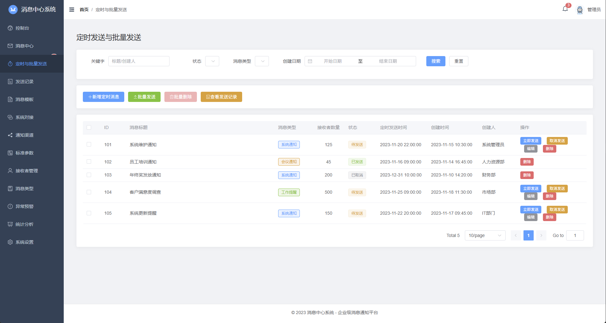

# 企业级消息中心系统

一个基于Vue 3 + Element Plus构建的企业级消息中心前端系统，支持多系统对接、多渠道消息发送、消息模板管理等功能。


## ✨ 核心功能

- 🔗 **系统对接管理** - 管理接入的外部系统，提供API密钥认证
- 📝 **消息模板管理** - 支持多变量模板，版本控制，审核发布
- 👥 **接收者管理** - 个人和群组管理，订阅设置
- 📢 **通知渠道管理** - 邮件、短信、微信、钉钉等多渠道支持
- ⏰ **定时发送** - 支持定时消息发送和批量处理
- 📊 **统计分析** - 发送统计、成功率分析、渠道监控
- 🔍 **消息记录** - 完整的消息发送记录和状态追踪

## 🖥️ 系统界面展示

### 控制台


### 系统对接管理


### 消息模板管理


### 接收者管理


### 通知渠道管理


### 定时发送


### 发送记录


### 统计分析


## 🚀 快速开始

### 环境要求

- Node.js 16+
- npm 8+ 或 yarn 1.22+

### 安装与启动

1. **克隆项目**
   ```bash
   git clone [项目地址]
   cd message-center-ui
   ```

2. **安装依赖**
   ```bash
   npm install
   ```

3. **启动开发环境**
   ```bash
   npm run dev
   ```
   
   启动成功后，浏览器自动打开 `http://localhost:5173`

4. **构建生产环境**
   ```bash
   npm run build
   ```

### 目录结构

```
message-center-ui/
├── src/
│   ├── components/          # 公共组件
│   ├── views/              # 页面组件
│   │   ├── dashboard/      # 控制台
│   │   ├── systems/        # 系统对接管理
│   │   ├── templates/      # 消息模板管理
│   │   ├── recipients/     # 接收者管理
│   │   ├── channels/       # 通知渠道管理
│   │   ├── messages/       # 消息发送与记录
│   │   └── analytics/      # 统计分析
│   ├── router/             # 路由配置
│   ├── store/              # 状态管理
│   ├── utils/              # 工具函数
│   └── styles/             # 样式文件
├── public/                 # 静态资源
└── screenshots/            # 系统截图
```

## 🛠️ 开发工具配置

### 推荐IDE配置

- [VSCode](https://code.visualstudio.com/)
- [Volar插件](https://marketplace.visualstudio.com/items?itemName=Vue.volar) (请禁用Vetur插件)

### 配置说明

详见 [Vite 配置文档](https://vitejs.dev/config/)

## 📚 系统架构

### 前端技术栈

- **框架**: Vue 3 (Composition API)
- **UI组件库**: Element Plus
- **构建工具**: Vite
- **路由**: Vue Router 4
- **状态管理**: Pinia
- **HTTP客户端**: Axios
- **图表库**: ECharts

### 核心模块设计

#### 1. 系统对接管理
- 管理外部系统接入信息
- API密钥生成与验证
- 系统权限控制
- IP白名单管理

#### 2. 消息模板管理
- 多变量模板设计
- 模板版本控制
- 审核流程管理
- 变量类型验证

#### 3. 接收者管理
- 个人/群组接收者
- 联系方式管理
- 订阅偏好设置
- 批量导入功能

#### 4. 通知渠道管理
- 多渠道统一管理
- 渠道参数配置
- 发送策略设置
- 渠道状态监控

#### 5. 消息发送
- 实时/定时发送
- 批量消息处理
- 发送状态追踪
- 失败重试机制

#### 6. 统计分析
- 发送量统计
- 成功率分析
- 渠道性能监控
- 数据可视化

## 🔧 配置说明

### 环境变量

在项目根目录创建 `.env.local` 文件：

```bash
# API接口地址
VITE_API_BASE_URL=http://localhost:8080/api

# WebSocket地址
VITE_WS_URL=ws://localhost:8080/ws

# 文件上传地址
VITE_UPLOAD_URL=http://localhost:8080/upload
```

### API接口配置

系统通过RESTful API与后端通信，主要接口包括：

- `/api/systems` - 系统对接管理
- `/api/templates` - 消息模板
- `/api/recipients` - 接收者管理
- `/api/channels` - 通知渠道
- `/api/messages` - 消息发送
- `/api/analytics` - 统计分析

## 🤝 开发指南

### 代码规范

- 使用ESLint + Prettier进行代码格式化
- 遵循Vue 3 Composition API最佳实践
- 组件命名采用PascalCase
- 文件命名采用kebab-case

### 提交规范

```bash
feat: 新功能
fix: 修复bug
docs: 文档更新
style: 代码格式调整
refactor: 代码重构
test: 测试相关
chore: 构建/工具相关
```

## 📄 许可证

[MIT License](LICENSE)

---

## 系统详细设计文档

### 一、系统概述

消息中心系统是一个集中管理和分发各类消息通知的平台，支持多系统对接、多模板管理、多接收者配置、多通知渠道和多消息类型。

### 二、功能模块设计

#### 1. 系统对接管理模块

**功能**：
- 管理接入消息中心的外部系统
- 提供API接口供外部系统调用
- 管理系统权限和鉴权信息

**核心字段**：
- 系统ID：唯一标识符
- 系统名称：对接系统名称
- 系统描述：系统简介
- 接入密钥：API调用认证密钥
- 回调URL：消息发送结果回调地址
- 状态：启用/禁用
- 创建时间：系统接入时间
- 更新时间：最后更新时间
- IP白名单：允许访问的IP列表

#### 2. 消息模板管理模块

**功能**：
- 创建和管理消息模板
- 支持多变量占位符设置
- 支持多通知渠道的模板内容
- 模板版本控制和审核

**核心字段**：
- 模板ID：唯一标识符
- 模板名称：模板名称
- 模板编码：业务编码
- 模板类型：对应消息类型
- 适用渠道：支持的通知渠道列表
- 模板内容：各渠道的具体内容
- 变量列表：支持的变量配置
- 状态：草稿/审核中/已发布/已禁用

#### 3. 接收者管理模块

**功能**：
- 管理消息接收者信息
- 支持个人和群组两种接收者类型
- 管理接收者的联系方式
- 支持接收者订阅和屏蔽设置

#### 4. 通知渠道管理模块

**功能**：
- 管理各种消息发送渠道
- 配置渠道参数和发送规则
- 监控渠道状态和发送情况
- 支持渠道优先级和失败转移

#### 5. 消息发送管理模块

**功能**：
- 接收外部系统的消息请求
- 根据模板和变量生成消息内容
- 选择合适的渠道发送消息
- 记录发送状态和历史

#### 6. 统计分析模块

**功能**：
- 统计消息发送数量和状态
- 分析各渠道发送成功率
- 监控系统性能和负载
- 生成报表和可视化图表

### 三、系统架构

1. **前端层**：Vue 3 + Element Plus构建的管理界面
2. **接口层**：RESTful API接口，鉴权和安全控制
3. **业务层**：消息处理核心服务，模板引擎
4. **存储层**：关系型数据库，NoSQL数据库，缓存服务
5. **基础设施**：消息队列，日志系统，监控告警